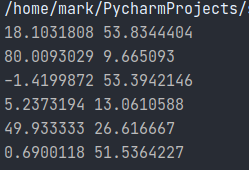

# DB course
### Lab 7
Requirements:
```
pip install geopy
pip install psycopg2
```


As in assignment was mentioned that we need to write sql dunction and call it from the python code.
In connemts I have SQL function:
```sql
CREATE OR REPLACE FUNCTION retreive_addresses()
RETURNS TABLE(address VARCHAR(50), address2 VARCHAR(50)) AS
$$
BEGIN
RETURN QUERY
SELECT address.address, address.address2 FROM address
WHERE address.address_id > 400 AND address.address_id < 600
AND (address.address LIKE '%11%' OR address.address2 LIKE '%11%');
END; 
$$
LANGUAGE plpgsql;
```
Then I call in in python code. After it I call geoPy and printing the result in cosole (since at lab time was clarification that we don't need to modify table and just print it in console)

here is a screenshot of an output:




Thanks :)